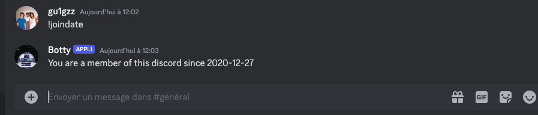

# Botty

A basic bot who executes some commands.

## Installation

## Usage example

Return the joindate with !joindate:

## Release History

* 0.0.1
    * Work in progress

## Linkedin

Your Name – [@YourTwitter](https://twitter.com/dbader_org) – YourEmail@example.com

<!-- Markdown link & img dfn's -->
[npm-image]: https://img.shields.io/npm/v/datadog-metrics.svg?style=flat-square
[npm-url]: https://npmjs.org/package/datadog-metrics
[npm-downloads]: https://img.shields.io/npm/dm/datadog-metrics.svg?style=flat-square
[travis-image]: https://img.shields.io/travis/dbader/node-datadog-metrics/master.svg?style=flat-square
[travis-url]: https://travis-ci.org/dbader/node-datadog-metrics
[wiki]: https://github.com/yourname/yourproject/wiki

